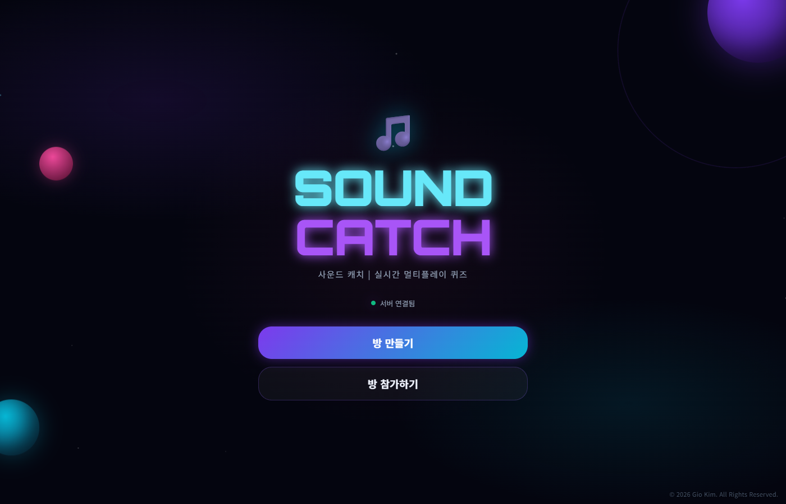
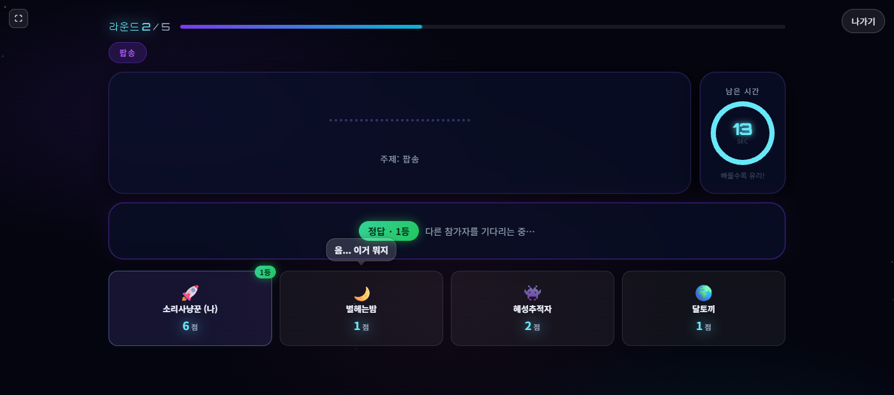
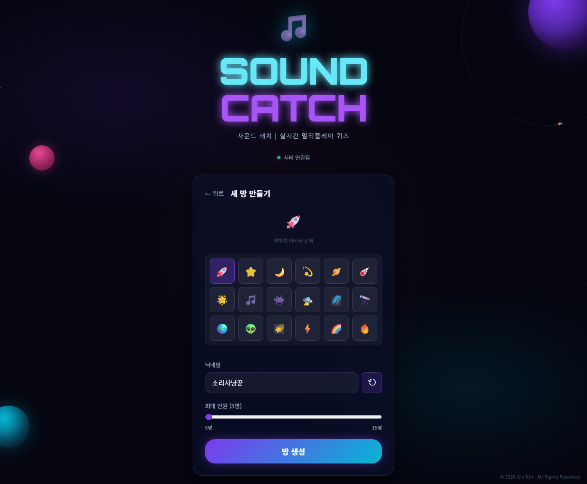
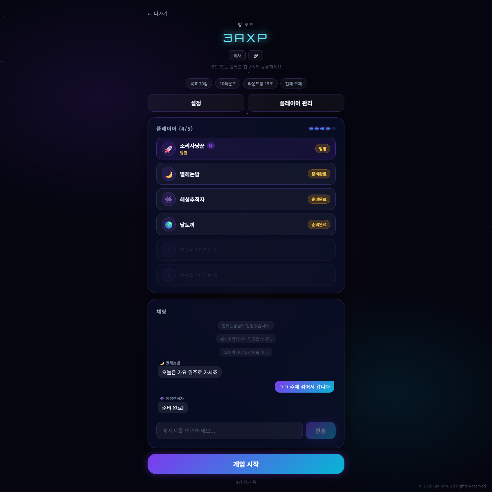
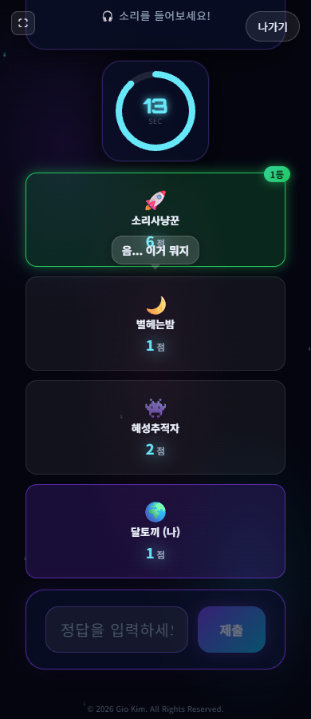
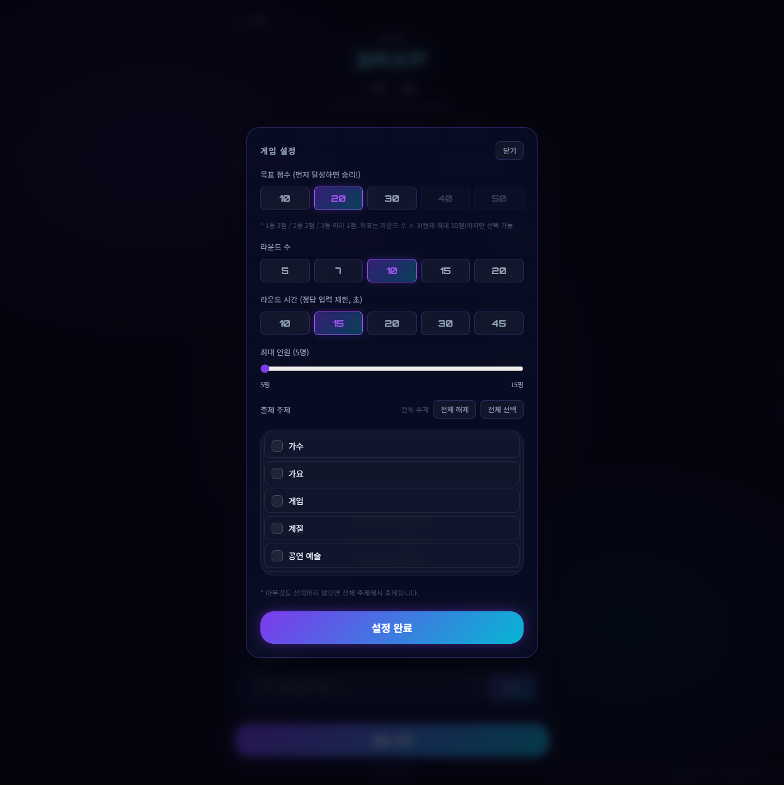
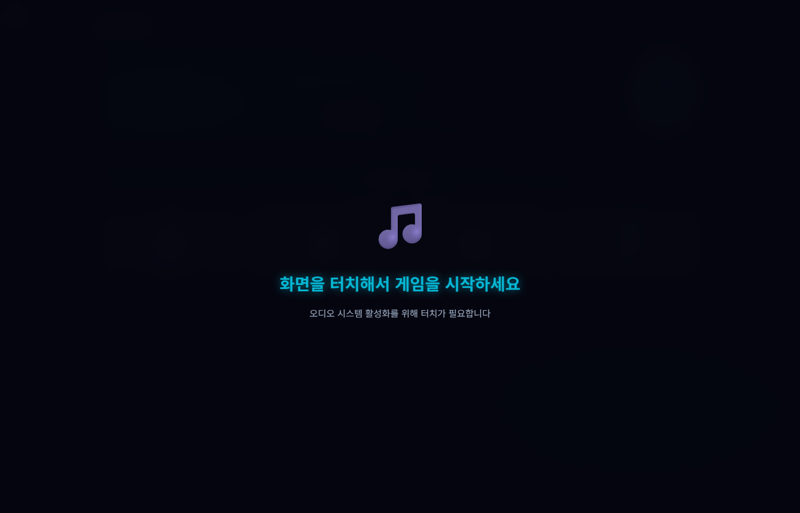
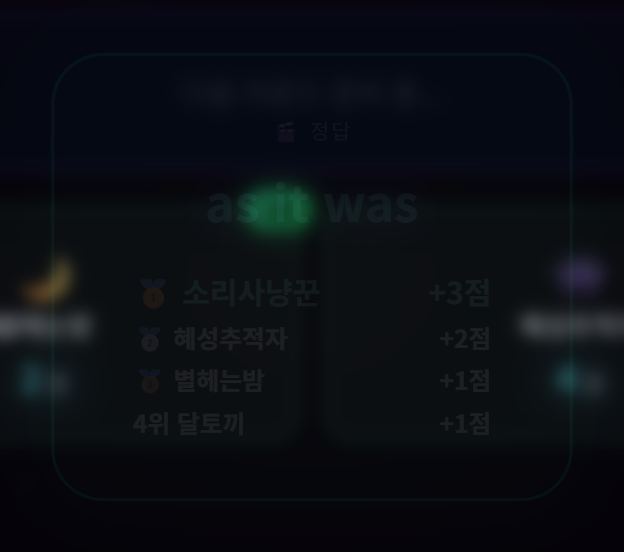
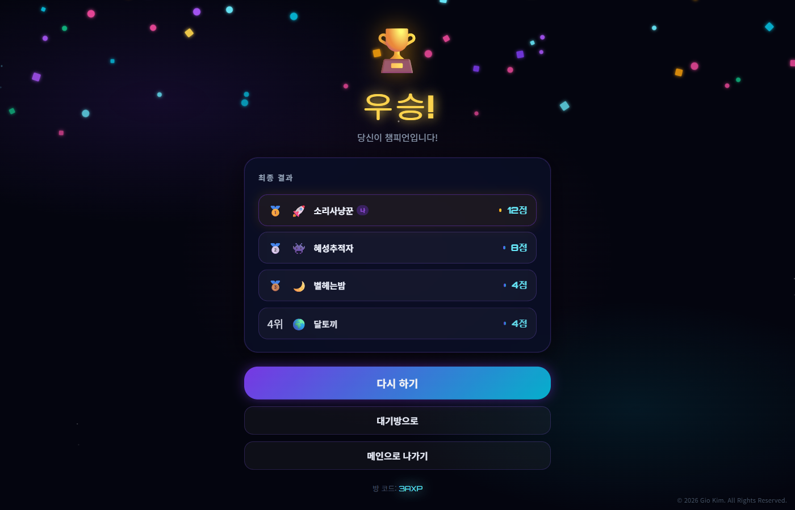
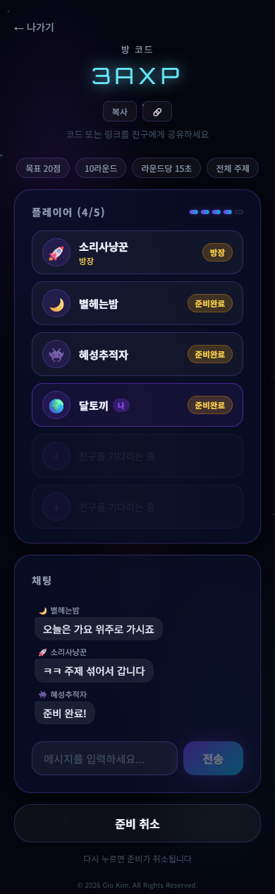

<div align="center">

# 🎵 Sound Catch · 사운드 캐치

**들려주는 소리의 정체를 먼저 맞히는 사람이 이기는 실시간 멀티플레이 사운드 퀴즈쇼**

[](https://sound-quiz-show.vercel.app)

[](https://react.dev)
[](https://vite.dev)
[](https://nodejs.org)
[](https://socket.io)
[](#-저작권--라이선스)



</div>

---

## 무슨 게임인가요

방 코드 하나로 친구들과 모여, **10초짜리 소리를 듣고 그게 뭔지 먼저 맞히는** 게임입니다.

노래·효과음·게임 사운드·동물 울음소리·나라별 국가까지 **28개 주제 1,146문항**이 들어 있고,
문제가 나오면 모두의 브라우저에서 **같은 소리가 동시에** 흘러나옵니다.
먼저 맞힐수록 점수를 많이 가져가고, 목표 점수에 먼저 도달한 사람이 우승합니다.

진행자(MC)가 따로 필요 없습니다. 출제·재생·채점·점수 집계를 서버가 전부 처리합니다.

<div align="center">

<br><sub>라운드 진행 화면 — 주제 배지, 남은 시간, 참가자 부스, 실시간 정답 말풍선</sub>
</div>

---

## 목차

- [플레이 방법](#플레이-방법)
- [게임 규칙](#게임-규칙)
- [주요 기능](#주요-기능)
- [화면 둘러보기](#화면-둘러보기)
- [기술 스택](#기술-스택)
- [설계에서 실제로 풀어낸 문제들](#설계에서-실제로-풀어낸-문제들)
- [퀴즈 데이터셋](#퀴즈-데이터셋)
- [로컬에서 실행하기](#로컬에서-실행하기)
- [배포](#배포)
- [프로젝트 구조](#프로젝트-구조)
- [WebSocket 이벤트 명세](#websocket-이벤트-명세)
- [트러블슈팅](#트러블슈팅)
- [남은 할 일](#-남은-할-일)
- [저작권 & 라이선스](#-저작권--라이선스)

---

## 플레이 방법

| 1. 방 만들기 | 2. 친구 초대 | 3. 소리 듣고 맞히기 |
|---|---|---|
| 닉네임·아바타를 고르고 최대 인원(5~15명)을 정해 방을 만듭니다 | 4자리 방 코드나 공유 링크를 보내면 친구가 바로 들어옵니다 | 소리가 재생되면 제한 시간 안에 정답을 입력합니다 |
|  |  |  |

> **공유 링크**는 `?room=코드` 형태입니다. 링크로 접속하면 참가 모드로 방 코드가 자동 입력됩니다.
> 카카오톡으로 링크를 보내도 인앱 브라우저를 자동으로 빠져나와 크롬/사파리에서 열립니다.

---

## 게임 규칙

### 순위 점수제

같은 라운드 안에서 **정답을 맞힌 순서**대로 점수가 갈립니다.

| 정답 순위 | 획득 점수 |
|---|---|
| 🥇 1등 | **+3점** |
| 🥈 2등 | **+2점** |
| 🥉 3등 이하 | **+1점** |
| 못 맞힘 / 시간 초과 | 0점 |

1등만 득점하는 방식이면 한 번 뒤처진 사람은 남은 라운드를 포기하게 됩니다.
2·3등에게도 부분 점수를 주어 **마지막 라운드까지 계속 입력할 이유**를 남겼습니다.

### 보너스 라운드

일정 조건에서 **점수 2배** 라운드가 발동합니다.

| 조건 | 값 |
|---|---|
| 발동 확률 | 20% |
| 최소 라운드 | 5라운드부터 |
| 게임당 최대 | 2회 |
| 배점 | 1등 6점 / 2등 4점 / 3등 이하 2점 |

초반부터 터지면 판이 일방적으로 기울기 때문에 **5라운드 이후**로 제한하고, 게임당 2회로 묶었습니다.

### 승리 조건

- 목표 점수(10 / 20 / 30 / 40 / 50점)에 **먼저 도달**하면 즉시 종료
- 마지막 라운드까지 아무도 도달하지 못하면 **최고 득점자 승리**
- 동점자가 둘 이상이면 **무승부**

> 라운드당 최대 획득이 3점이므로, 목표 점수는 `라운드 수 × 3`을 넘지 못하도록 UI에서 막아 둡니다.
> (예: 5라운드를 고르면 40·50점 선택지가 자동으로 잠깁니다)

---

## 주요 기능

**게임 진행**
- 방 코드 4자리(32진수 · 약 105만 조합, 헷갈리는 `I·O·1·0` 제외)로 즉시 입장
- 주제 안내 음성 → 소리 재생 → 타이머 → 정답 공개로 이어지는 퀴즈쇼식 진행
- 28개 주제별 **전용 안내 음성**, 오프닝 나레이션(방장이 스킵 가능), 보너스 라운드 연출
- 오답은 말풍선으로 모두에게 공개, **정답은 텍스트를 숨기고 순위만 방송** — 따라치기 방지
- 라운드 종료 시 정답 공개 + 순위별 획득 점수 요약

**방 운영**
- 방장 권한: 게임 설정 변경, 강퇴, 방장 위임, 오프닝 스킵, 대기방 복귀
- 방장이 설정을 바꾸면 **전원 화면에 실시간 반영**
- 준비완료 게이트 — 방장 외 전원이 준비해야 시작 가능
- 대기방 채팅 (입장·퇴장·설정 변경 등 시스템 알림 포함)
- 18종 이모지 아바타, 랜덤 우주 컨셉 닉네임 생성기

**설정 가능한 항목**

| 항목 | 선택지 |
|---|---|
| 목표 점수 | 10 / 20 / 30 / 40 / 50 |
| 라운드 수 | 5 / 7 / 10 / 15 / 20 |
| 라운드 시간 | 10 / 15 / 20 / 30 / 45초 |
| 최대 인원 | 5 ~ 15명 |
| 출제 주제 | 28개 주제 개별 선택 (미선택 시 전체) |

**안정성**
- 연결이 끊겨도 **2분 유예** 후 제거 — 그 사이 재접속하면 점수·방장 권한 그대로 복구
- 진행 단계(대기방 / 게임 중 / 결과)를 서버가 기억해 **재접속 시 알맞은 화면으로 복원**
- 게임 중 새로고침·뒤로가기 방지 확인창
- 모바일 대응 (하단 고정 레이아웃, safe-area 반영)

---

## 화면 둘러보기

<table>
<tr>
<td width="50%"><br><sub><b>게임 설정</b> — 목표 점수·라운드·시간·인원·주제를 방장이 조정하면 전원에게 즉시 반영됩니다</sub></td>
<td width="50%"><br><sub><b>오디오 언락</b> — 브라우저 자동재생 정책 때문에 전원이 화면을 한 번 터치해야 소리가 동시에 나갑니다</sub></td>
</tr>
<tr>
<td width="50%" align="center"><br><sub><b>라운드 결과</b> — 정답을 공개하고 정답자 순위와 획득 점수를 보여줍니다</sub></td>
<td width="50%"><br><sub><b>최종 결과</b> — 우승자 연출과 최종 순위. 같은 설정으로 바로 다시 하기 가능</sub></td>
</tr>
</table>

### 모바일

<div align="center">


</div>

---

## 기술 스택

| 영역 | 사용 기술 |
|---|---|
| 프론트엔드 | React 18, Vite 5, Context + useReducer, 순수 CSS(디자인 토큰) |
| 실시간 통신 | Socket.IO 4 (WebSocket 우선, polling 폴백) |
| 백엔드 | Node.js 18+, Express 4, Socket.IO 4 |
| 오디오 | YouTube IFrame Player API (구간 재생), Web Audio API (틱 사운드), HTMLAudioElement (나레이션) |
| 데이터 | 단일 JS 모듈(`quizData.js`) + 부팅 시 YouTube oEmbed 유효성 검사 |
| 데이터 관리 도구 | Python 표준 라이브러리만 사용한 로컬 웹 에디터 |
| 배포 | Vercel(클라이언트) + Render(서버) |

### 아키텍처

```
┌──────────────────────────┐         WebSocket          ┌──────────────────────────┐
│  React Client (Vercel)   │ ◄────────────────────────► │  Node Server (Render)    │
│                          │      Socket.IO 4           │                          │
│  ├ GameContext           │                            │  ├ rooms: Map<code,Room> │
│  │   화면·플레이어·라운드 │  join / start / answer     │  ├ 라운드 타이머          │
│  ├ useSocket             │  ─────────────────────►    │  ├ 순위 채점              │
│  │   싱글톤 소켓·이벤트큐 │                            │  ├ LFU 출제 선택          │
│  ├ YouTube IFrame Player │  ◄─────────────────────    │  └ 재접속 유예 타이머     │
│  │   숨김 플레이어, 구간  │  round_start / scored /    │                          │
│  └ 카테고리 안내 MP3      │  round_result / game_over  │  quizData.js (1,146문항) │
└──────────────────────────┘                            └──────────────────────────┘
                                     ▲
                                     │ 부팅 시 1회
                                     ▼
                          YouTube oEmbed 유효성 검사
```

**서버가 진실의 원천(single source of truth)입니다.** 클라이언트는 정답을 절대 알지 못하며,
타이머 시작·채점·순위·라운드 종료를 전부 서버가 결정하고 방송합니다.
클라이언트는 서버가 보낸 `youtubeId`와 재생 구간만 받아 소리를 재생합니다.

---

## 설계에서 실제로 풀어낸 문제들

> 이 프로젝트에서 가장 오래 붙잡았던 문제들과, 코드로 남긴 해결 방식입니다.

### 1. 여러 브라우저에서 "동시에" 소리가 나게 만들기

가장 어려웠던 부분입니다. 브라우저는 사용자 제스처 없이 소리를 재생하지 못하고,
기기·회선마다 버퍼링 속도가 달라 그냥 재생하면 **누구는 이미 듣고 누구는 아직 로딩 중**인 상태가 됩니다.
먼저 들은 사람이 무조건 이기는 게임이 되어 버립니다.

3단계로 나눠서 해결했습니다.

1. **오디오 언락 게이트** — 게임이 시작되면 전원에게 "화면을 터치하세요" 오버레이를 띄우고,
   터치 시 무음 버퍼 재생 + YouTube 플레이어 워밍업으로 오디오 컨텍스트를 열어 `ready_to_start`를 보냅니다.
   전원이 완료되면 서버가 첫 라운드를 시작합니다. 누군가 안 누르거나 튕겨도 **10초 뒤 강제 시작**합니다.
2. **재생 시작 핸드셰이크** — 각 클라이언트는 YouTube 플레이어가 실제 `PLAYING` 상태가 된 순간
   `music_started`를 보냅니다. 서버는 접속 중인 **전원의 신호가 모이면 즉시**,
   일부만 도착했으면 **첫 신호로부터 4초 뒤**에 정답 입력창을 엽니다(느린 기기 보호).
3. **폴백 타이머** — 신호가 아예 안 오는 경우(광고·지역 차단 등)를 대비해
   1라운드 40초 / 이후 15초 뒤 강제로 입력창을 엽니다. 게임이 멈추는 상황을 원천 차단합니다.

정답 입력창은 **서버가 `timer_start`를 보낸 뒤에만** 열립니다.
즉, 재생이 빠른 사람이 먼저 입력할 수 있는 구조 자체를 없앴습니다.

### 2. 끊겨도 게임이 안 망가지게 만들기

`socket.id`는 재연결할 때마다 바뀝니다. 이걸 플레이어 식별자로 쓰면
지하철에서 잠깐 끊긴 사람이 **점수 0점짜리 새 플레이어**가 되고, 방장이 끊기면 방이 마비됩니다.

- **영구 토큰(pid)** — 브라우저마다 `localStorage`에 한 번 발급해 보관하고, 이걸로 플레이어를 식별합니다.
- **2분 유예** — 끊겨도 즉시 제거하지 않고 `disconnected` 표시만 합니다.
  그 안에 돌아오면 소켓만 다시 바인딩되어 점수·방장 권한이 그대로 유지됩니다.
- **실효 방장(effective host)** — 방장이 끊긴 동안에는 접속 중인 다른 플레이어가 임시로 방장 역할을 맡고,
  원래 방장이 돌아오면 **자동으로 회복**됩니다. 방에 방장이 없는 순간이 존재하지 않습니다.
- **단계 복원** — 방이 `lobby / game / gameover` 중 어느 단계인지 서버가 기억하고 있어서,
  재접속한 사람을 알맞은 화면으로 되돌려 놓습니다. 게임 중 복귀라면 오프닝 나레이션은 건너뜁니다.

### 3. 같은 주제만 몰려 나오던 출제 버그

문제가 카테고리별로 뭉쳐 저장돼 있는데 `sort(() => Math.random() - 0.5)`로 섞고 있었습니다.
이 방식은 **균등 셔플이 아닙니다.** 원소가 원래 위치 근처에 남아, 10라운드가 통째로 「가요」로 채워지곤 했습니다.

- **Fisher-Yates 셔플**로 교체해 균등 분포를 확보했습니다.
- 그 위에 **LFU(least-frequently-used) 안정 정렬**을 얹었습니다.
  방 단위로 "문제별 등장 횟수"를 세고 적게 나온 문제부터 뽑습니다.
  → 풀을 한 바퀴 다 돌기 전에는 같은 문제가 다시 나오지 않고, 주제를 하나만 골라 풀이 작아도 고갈되지 않습니다.
- **쏠림 상한** — 한 게임 안에서 같은 영상은 3회까지, 같은 주제는 `max(3, ⌈라운드÷주제수⌉)`까지만 허용합니다.
  주제를 적게 고르면 상한이 자동으로 완화되어(1개만 고르면 사실상 해제) 정상 동작합니다.

### 4. 오타를 봐주다가 오답까지 통과시킨 채점기

처음에는 Levenshtein 거리 기반 퍼지 매칭으로 유사도 80% 이상이면 정답 처리했습니다.
오타에는 관대했지만 **명백한 오답까지 통과**시켜 판정 시비가 계속 나왔습니다.

정규화 후 **완전 일치**로 바꿨습니다.

```
"겨울 왕국!" → 유니코드 정규화(NFC) → 소문자 → 문자·숫자만 남김 → "겨울왕국"
```

대신 관용성은 **데이터 쪽으로 옮겼습니다.** `answers` 배열에 한글 표기, 영문 표기, 통용 별칭을
모두 등재해 인정 범위를 명시적으로 관리합니다. (예: `['(여자)아이들', '여자아이들', 'gidle', '(g)i-dle']`)
"어디까지 정답인가"가 알고리즘의 우연이 아니라 **데이터에 적힌 사실**이 되었습니다.

### 5. 멀쩡한 영상이 대량으로 탈락하던 사전 검사

서버 부팅 시 YouTube oEmbed로 전 영상의 재생 가능 여부를 확인합니다.
처음에는 `200 OK`가 아니면 전부 제외했는데, 900개 넘는 요청을 한꺼번에 쏘다 보니
**429(레이트 리밋)·403이 쏟아지며 멀쩡한 영상까지 무더기로 탈락**했습니다.

- **fail-open** — 확실히 없는 경우(`400` 잘못된 ID / `401` 비공개 / `404` 삭제)만 제외하고,
  레이트 리밋·5xx·타임아웃·네트워크 오류는 **유지**합니다.
- **중복 제거** — 1,146문항이 공유하는 고유 영상은 936개뿐입니다. 영상 단위로 한 번만 조회합니다.
- **동시 요청 12개 제한** — 배치로 나눠 보내 스로틀링 자체를 피합니다.

### 6. 카카오톡 인앱 브라우저 탈출

카카오톡으로 초대 링크를 보내면 인앱 웹뷰에서 열리는데, 여기서는 오디오 정책이 달라 게임이 제대로 돌지 않습니다.
User-Agent로 감지해 **Android는 `intent://` 스킴으로 크롬**을,
**iOS는 `openExternalBrowser=1` 파라미터로 사파리**를 띄웁니다.

### 7. 정답 따라치기 막기

누가 정답을 맞히면 그 텍스트를 그대로 방송할 경우, 남은 사람들이 보고 그대로 따라 칠 수 있습니다.

- **정답** — `player_scored`로 "누가 몇 등으로 맞혔다"만 방송합니다. 텍스트는 보내지 않습니다.
- **오답** — `player_guess`로 텍스트까지 방송합니다. 틀린 답은 공개돼도 문제없고, 오히려 재미 요소가 됩니다.
- 정답 텍스트는 라운드가 끝난 뒤 `round_result`에서 한 번에 공개됩니다.

---

## 퀴즈 데이터셋

**총 1,146문항 · 28개 주제 · 고유 영상 936개**

각 문항은 YouTube 영상의 **10초 남짓한 특정 구간**을 가리킵니다.
음원 파일을 직접 호스팅하지 않으므로 저장소 용량과 대역폭 비용이 들지 않습니다.

```js
{
  id: 'ar001',
  category: '가수',
  youtubeId: '9bZkp7q19f0',
  youtubeStart: 10,          // 재생 시작(초)
  youtubeEnd: 20,            // 재생 종료(초)
  hint: '강남스타일로 세계를 석권한 한국 대표 가수, 말춤의 주인공',
  answers: ['싸이', 'psy'],  // [0]이 대표 정답, 나머지는 추가 인정 표기
  difficulty: 1              // 1~3
}
```

<details>
<summary><b>주제별 문항 수 (28개)</b></summary>

| 주제 | 문항 | 주제 | 문항 | 주제 | 문항 |
|---|---:|---|---:|---|---:|
| 가요 | 200 | 물건/장소 | 35 | 스포츠 | 20 |
| 롤 챔피언 | 162 | 게임 | 32 | 운송수단 | 20 |
| 애니메이션 | 84 | 가수 | 31 | 유튜버 | 20 |
| 팝송 | 69 | 직업 | 31 | 클래식 음악 | 20 |
| 드라마 | 55 | 공연 예술 | 30 | 브랜드 | 19 |
| 영화 | 55 | 동요 | 29 | 언어 | 15 |
| 예능 | 46 | 동물 | 25 | 자연현상 | 15 |
| 작곡가 | 42 | 악기 | 25 | 춤의 종류 | 15 |
| | | 나라 | 20 | 불쾌한 소리 | 14 |
| | | | | 계절 | 9 |

난이도 분포 — 1(쉬움) 844 · 2(보통) 254 · 3(어려움) 48

</details>

### 데이터 관리 도구 (`server/quiz_validator.py`)

1,000문항이 넘어가면 텍스트 에디터로는 관리가 불가능해서 전용 도구를 만들었습니다.
**외부 패키지 없이 파이썬 표준 라이브러리만으로** 동작하는 로컬 웹 에디터입니다.

```bash
cd server
python quiz_validator.py     # http://localhost:8765 자동 실행
```

- 문항 **추가 / 수정 / 삭제** — 카테고리를 고르면 ID를 자동 부여, 시작 지점만 바꾸면 종료 지점은 `start+10`으로 자동 저장
- **재생 검사** — 전 영상을 oEmbed로 조회해 삭제·비공개·잘못된 ID를 검출하고 `quizData.js.check.json`에 캐시
- **중복 정답 탐지** — 대표 정답이 같은 문항을 묶어 표시, 필터링해서 한 번에 정리
- **안전장치** — 첫 저장 시 원본 백업(`.bak`), 매 저장마다 직전 상태 백업(`.bak.last`),
  수정 시 해당 줄의 필요한 필드만 정밀 치환해 주석·포맷 보존

---

## 로컬에서 실행하기

### 요구 사항

- Node.js 18 이상
- (선택) Python 3.8 이상 — 데이터 관리 도구용

### 설치 & 실행

```bash
git clone https://github.com/evan-cloud4453/sound-quiz-show.git
cd sound-quiz-show
npm run install:all
```

환경 변수는 없어도 기본값으로 동작합니다. 바꾸려면 아래 파일을 만드세요.

**`server/.env`**
```
PORT=3001
CLIENT_URL=http://localhost:5173
```

**`client/.env`**
```
VITE_SERVER_URL=http://localhost:3001
```

터미널 2개로 서버와 클라이언트를 각각 띄웁니다.

```bash
npm run dev:server    # 터미널 1 — http://localhost:3001
```
```bash
npm run dev:client    # 터미널 2 — http://localhost:5173
```

> 서버는 부팅 시 936개 영상의 유효성을 검사합니다. 콘솔에
> `✅ 유효 문제 N개 준비 완료`가 뜬 뒤에 게임을 시작하세요(보통 10~30초).

혼자 테스트할 때는 **시크릿 창이나 다른 브라우저**로 두 번째 탭을 여세요.
플레이어 식별에 `localStorage`를 쓰기 때문에 같은 프로필의 일반 탭 두 개는 **동일 인물**로 인식됩니다.

### 사용 가능한 스크립트

| 명령 | 설명 |
|---|---|
| `npm run install:all` | 서버·클라이언트 의존성 일괄 설치 |
| `npm run dev:server` | 서버 개발 모드 (nodemon) |
| `npm run dev:client` | 클라이언트 개발 서버 (Vite) |
| `npm run start:server` | 서버 프로덕션 실행 |
| `npm run build` | 클라이언트 프로덕션 빌드 |

---

## 배포

**클라이언트 → Vercel** / **서버 → Render** 조합으로 운영 중입니다.

<details>
<summary><b>Vercel (클라이언트)</b></summary>

저장소 루트의 `vercel.json`이 빌드 설정을 담고 있습니다.

1. New Project → GitHub 저장소 선택
2. 환경 변수 `VITE_SERVER_URL`에 배포된 서버 주소 입력
3. Deploy

</details>

<details>
<summary><b>Render (서버)</b></summary>

| 항목 | 값 |
|---|---|
| Root Directory | `server` |
| Build Command | `npm install` |
| Start Command | `node index.js` |
| Environment | Node |

환경 변수에 `CLIENT_URL`을 배포된 프론트엔드 주소로(끝에 슬래시 없이) 지정합니다.
서버는 `CLIENT_URL` 외에 `*.vercel.app` / `*.netlify.app` 도메인을 CORS에서 허용합니다.

무료 플랜은 15분 비활성 시 슬립됩니다. `/health` 엔드포인트를 UptimeRobot 등으로 5분마다 핑하면 유지됩니다.

</details>

---

## 프로젝트 구조

```
sound-quiz-show/
├── server/
│   ├── index.js              # 게임 서버 — 방·라운드·채점·타이머·재접속 전부
│   ├── quizData.js           # 퀴즈 데이터 1,146문항
│   └── quiz_validator.py     # 로컬 데이터 관리 웹 에디터 (표준 라이브러리만)
│
├── client/
│   ├── src/
│   │   ├── App.jsx                    # 화면 라우팅 + 연결 끊김 오버레이 + 저작권 표시
│   │   ├── utils/GameContext.jsx      # 전역 게임 상태 (useReducer) · 세션 복구
│   │   ├── hooks/useSocket.js         # Socket.IO 싱글톤 · 이벤트 포워딩
│   │   ├── pages/
│   │   │   ├── TitleScreen.jsx        # 닉네임·아바타·방 생성/참가
│   │   │   ├── LobbyScreen.jsx        # 대기실 · 설정 · 채팅 · 방장 관리
│   │   │   ├── GameScreen.jsx         # 라운드 시퀀스 · YouTube 재생 · 정답 입력
│   │   │   └── GameOverScreen.jsx     # 최종 순위 · 다시 하기
│   │   ├── components/
│   │   │   ├── WaveformVisualizer.jsx # 재생 중 파형 애니메이션
│   │   │   ├── TimerRing.jsx          # SVG 원형 타이머
│   │   │   ├── Confetti.jsx           # 우승 폭죽
│   │   │   ├── SystemToast.jsx        # 시스템 알림 토스트
│   │   │   └── Copyright.jsx          # 저작권 표시 (PC 우하단 / 모바일 하단 중앙)
│   │   └── styles/global.css          # 디자인 토큰 · 우주 테마 배경
│   └── public/sounds/
│       ├── opening_intro.mp3          # 오프닝 설명 나레이션
│       ├── opening_go.mp3             # 게임 시작 신호음
│       ├── bonus.mp3                  # 보너스 라운드 나레이션
│       └── categories/*.mp3           # 주제별 안내 음성 28종
│
├── docs/screenshots/                  # README용 스크린샷
├── vercel.json                        # Vercel 빌드 설정
└── package.json                       # 루트 편의 스크립트
```

---

## WebSocket 이벤트 명세

### Client → Server

| 이벤트 | 페이로드 | 설명 |
|---|---|---|
| `join_room` | `{ nickname, roomCode?, avatar, pid, maxPlayers? }` | 방 생성 또는 참가 (`roomCode` 없으면 생성) |
| `rejoin_room` | `{ pid, roomCode }` | 유예 시간 내 재접속 |
| `toggle_ready` | — | 준비완료 토글 |
| `update_settings` | `{ targetScore, roundCount, roundTime, categories, maxPlayers }` | 방 설정 변경 (방장) |
| `start_game` | `{ targetScore, roundCount, roundTime, categories, autoSkipOpening, fromRematch }` | 게임 시작 (방장) |
| `ready_to_start` | — | 오디오 언락 완료 신호 |
| `music_started` | — | 클라이언트 재생 시작 신호 |
| `submit_answer` | `{ answer }` | 정답 제출 |
| `skip_round` | — | 재생 불가 시 라운드 건너뛰기 |
| `skip_opening` | — | 오프닝 나레이션 스킵 (방장) |
| `chat_message` | `{ text }` | 대기방 채팅 |
| `transfer_host` | `{ targetId }` | 방장 위임 (방장) |
| `kick_player` | `{ targetId }` | 강퇴 (방장) |
| `return_to_lobby` | — | 결과 화면 → 대기방 복귀 (방장) |
| `leave_room` | — | 방 나가기 |

### Server → Client

| 이벤트 | 페이로드 | 설명 |
|---|---|---|
| `room_update` | `{ roomCode, players[], hostId, status, targetScore, roundCount, roundTime, categories[], ... }` | 방 상태 전체 갱신 |
| `game_started` | `{ totalRounds, targetScore, autoSkipOpening }` | 게임 시작 |
| `round_start` | `{ round, totalRounds, category, youtubeId, youtubeStart, youtubeEnd, timeLimit, isBonus, pointValue }` | 라운드 시작 (정답은 포함되지 않음) |
| `timer_start` | `{ timeLimit }` | 정답 접수 개시 — 이 신호 전에는 입력 불가 |
| `player_guess` | `{ playerId, nickname, text, correct: false }` | 오답 말풍선 (텍스트 포함) |
| `player_scored` | `{ playerId, nickname, rank }` | 정답 처리 (텍스트 미포함) |
| `answer_result` | `{ correct: false, message }` | 개인 오답 통지 |
| `round_result` | `{ answer, ranking[], noWinner, isBonus, scores[] }` | 라운드 종료 — 정답 공개 + 순위 |
| `game_over` | `{ winner, isDraw, drawPlayers[], finalScores[], roomCode }` | 게임 종료 |
| `back_to_lobby` | — | 대기방 복귀 |
| `skip_opening` | — | 오프닝 스킵 전파 |
| `kicked` | — | 강퇴 통지 |
| `system_message` | `{ text }` | 시스템 알림 |
| `chat_message` | `{ id, playerId, nickname, text, ts }` | 채팅 브로드캐스트 |

### HTTP 엔드포인트

| 메서드 | 경로 | 응답 |
|---|---|---|
| `GET` | `/health` | `{ status: 'ok', uptime }` — 슬립 방지용 헬스체크 |
| `GET` | `/` | `{ name, version }` |

---

## 트러블슈팅

<details>
<summary><b>"서버 연결 중..."에서 멈춰요</b></summary>

서버가 실행 중인지, `client/.env`의 `VITE_SERVER_URL`이 올바른지 확인하세요.
배포 환경이라면 Render 무료 플랜이 슬립 상태일 수 있습니다(첫 접속 시 30초가량 소요).
</details>

<details>
<summary><b>소리가 안 나요</b></summary>

브라우저 자동재생 정책상 게임 시작 시 **화면을 한 번 터치**해야 오디오가 활성화됩니다.
언락 오버레이를 건너뛰었다면 새로고침 후 다시 시도하세요.
</details>

<details>
<summary><b>영상을 불러올 수 없다고 나와요</b></summary>

해당 영상이 삭제·비공개 처리되었거나 지역 제한이 걸린 경우입니다.
서버는 부팅 시 이를 걸러내지만 운영 중에 상태가 바뀔 수 있습니다.
`skip_round`로 자동 처리되며, `python server/quiz_validator.py`의 재생 검사로 정리할 수 있습니다.
</details>

<details>
<summary><b>혼자 테스트하는데 두 번째 탭이 같은 사람으로 인식돼요</b></summary>

플레이어 식별에 `localStorage`의 `sqs_pid`를 사용하기 때문입니다.
시크릿 창이나 다른 브라우저를 사용하세요.
</details>

<details>
<summary><b>CORS 오류가 발생해요</b></summary>

서버의 `CLIENT_URL` 환경 변수가 프론트엔드 주소와 **정확히** 일치해야 합니다(끝에 슬래시 없이).
</details>

---

## 📌 남은 할 일

### 1. 게임 데이터 DB 정제 — 무결성 확보

현재 1,146문항 중 서버 부팅 검사에서 **평균 130여 개가 재생 불가로 제외**되고 있습니다.
정답 표기가 어색하거나 대표 정답이 중복된 문항도 남아 있어 전수 점검이 필요합니다.

- [ ] 재생 불가 영상 전수 교체 (`quiz_validator.py`의 재생 검사 → 재생 불가 필터로 일괄 확인)
- [ ] 대표 정답 중복 문항 정리 (중복 정답 필터 활용)
- [ ] 정답 표기 검수 — 한글·영문·별칭이 `answers` 배열에 빠짐없이 들어갔는지
- [ ] **우선 점검 대상 주제 — 「불쾌한 소리」·「유튜버」·「군가」**
      세 주제는 문항 수가 적은 데다(각 14 / 20 / 8개) 정답 판정이 특히 모호합니다.
      「불쾌한 소리」는 정답 표기 자체가 사람마다 갈리고, 「유튜버」는 채널명 표기가 여러 갈래이며,
      「군가」는 곡 제목·부대명 혼용 문제가 있습니다.

### 2. 「계이름」 카테고리 추가

- [ ] 도·레·미 계이름을 맞히는 신규 주제 신설
- [ ] 문항 데이터 작성 및 `quizData.js` 등재
- [ ] 주제 안내 음성 `client/public/sounds/categories/계이름.mp3` 제작
- [ ] `GameScreen.jsx`의 `CATEGORY_AUDIO` 매핑에 키 추가
      (키는 공백·특수문자를 제거한 형태로 넣어야 매칭됨 — 예: `'공연 예술'` → `'공연예술'`)

### 3. 「가요」 연도별 하위 선택 항목

노래 주제에 **연도별 하위 필터**를 추가합니다. 예: 가요 > 1990년대 / 2000년대 / 2010년대 / 2020년대

설계 방향은 이렇습니다.

- **카테고리별 알고리즘에는 영향을 주지 않습니다.** 출제 분산의 주제 쏠림 상한(`CATEGORY_CAP`)이나
  LFU 선택은 하위 항목을 **동일한 하나의 카테고리**로 취급합니다.
  연도는 어디까지나 카테고리 **내부의 필터**입니다.
- **하위 체크박스는 순수 필터입니다.** 체크한 연도의 문항만 출제 풀에 들어갑니다.
  아무것도 체크하지 않으면 해당 카테고리 전체에서 출제합니다.

> ⚠️ **대규모 작업입니다.** 데이터 구조 변경이 선행되어야 하고, 영향 범위가 넓습니다.
>
> - `quizData.js` — 전 문항에 `subCategory`(또는 `year`) 필드 추가. 「가요」 200문항의 연도를 일일이 조사해야 합니다.
> - `server/index.js` — `getRandomQuestions()`의 필터 로직을 `category` 단독에서 `category + subCategory` 조합으로 확장.
>   `ALL_CATEGORIES` 구성과 `getRoomState()`가 내려주는 주제 목록도 계층 구조로 변경.
> - `LobbyScreen.jsx` — 설정 모달의 주제 체크리스트를 2단 트리 UI로 재작성. 선택 상태 관리와 팝오버 표시 로직도 함께 수정.
> - `quiz_validator.py` — 신규 필드를 읽고 쓰도록 정규식 파서와 편집 폼 확장.

---

## 📄 저작권 & 라이선스

**© 2026 Gio Kim. All Rights Reserved.**

이 저장소는 **포트폴리오 공개를 목적으로** 소스 코드를 열람할 수 있게 둔 것이며,
오픈소스 라이선스가 부여된 것이 아닙니다. 전문은 [`LICENSE`](LICENSE) 파일을 참고하세요.

### 저작권자에게 유보되는 권리

이 프로젝트의 **모든 기획과 창작적 산물의 저작권은 전적으로 저작권자(Gio Kim)에게 있습니다.**

- 게임 기획 및 컨셉 — 사운드 퀴즈쇼라는 형식, 진행 연출, 화면 구성
- 게임 규칙 및 시스템 설계 — 순위 점수제, 보너스 라운드, 준비완료 게이트, 재접속 유예 규칙
- 퀴즈 데이터베이스의 **구성과 편집** — 주제 분류 체계, 문항 선정, 재생 구간 선정, 정답·별칭 목록, 힌트 문안
- 소스 코드 전체 및 UI/UX 디자인, 주제 안내 음성 및 나레이션 구성

### 금지되는 행위

명시적인 서면 허락 없이 다음 행위를 금지합니다.

- 소스 코드 및 퀴즈 데이터의 복제·재배포·2차적 저작물 작성
- 상업적 이용 (서비스 운영, 광고 수익화, 유료 배포 등)
- 게임 기획·규칙·데이터 구성을 그대로 가져다 별도 서비스로 만드는 행위

학습·연구 목적의 **열람과 참고는 자유롭게 하셔도 됩니다.**
인용하실 때는 출처를 밝혀 주시면 감사하겠습니다.

### 제3자 콘텐츠에 관하여

**퀴즈 문항이 재생하는 음원은 이 저장소가 보유하거나 배포하는 것이 아닙니다.**

- 모든 소리는 **YouTube에 게시된 영상**을 YouTube IFrame Player API로 **원본 그대로 스트리밍**합니다.
  저장소에는 영상 ID와 재생 구간(시작·종료 초)만 기록되어 있으며, 음원 파일은 일절 포함되어 있지 않습니다.
- 재생되는 영상의 저작권은 **각 저작권자 및 YouTube 게시자에게 있습니다.**
  재생은 YouTube의 서비스 약관과 임베드 정책을 따릅니다.
- 이 게임은 **비영리 개인 프로젝트**이며, 광고·과금·수익화 요소가 일절 없습니다.
- 저작권자께서 특정 영상의 사용 중단을 요청하시면 즉시 해당 문항을 삭제하겠습니다.
  [이슈](https://github.com/evan-cloud4453/sound-quiz-show/issues)로 알려 주세요.

주제 안내 음성·오프닝 나레이션·보너스 나레이션 등 `client/public/sounds/` 의 오디오는
이 프로젝트를 위해 별도로 제작된 것이며 위 저작권 조항의 적용을 받습니다.

---

<div align="center">
<sub>

**Sound Catch** · 기획 · 개발 · 데이터 구축 — [Gio Kim](https://github.com/evan-cloud4453)

© 2026 Gio Kim. All Rights Reserved.

</sub>
</div>
