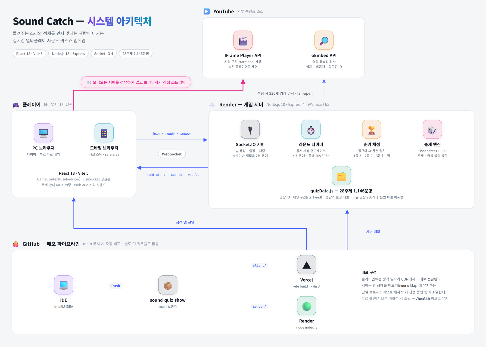

<div align="left">

# Sound Catch · 사운드 캐치

**들려주는 소리의 정체를 먼저 맞히는 사람이 이기는 실시간 멀티플레이 사운드 퀴즈쇼 웹게임**

[](https://sound-quiz-show.vercel.app)


[](LICENSE)


</div>

---

## 개요

방 코드로 모인 최대 15명이 같은 소리를 동시에 듣고, 그 정체를 먼저 입력한 사람이 점수를 가져가는 웹게임이다.
28개 주제 1,146문항을 갖췄으며, 출제 · 재생 동기화 · 채점 · 점수 집계를 서버가 전담하므로 진행자가 필요 없다.

음원은 저장소에 포함하지 않는다. 각 문항은 YouTube 영상의 특정 구간(중앙값 10초)을 가리키며,
재생은 각 브라우저가 IFrame Player API로 직접 수행한다.

| | |
|---|---|
| **플레이** | [sound-quiz-show.vercel.app](https://sound-quiz-show.vercel.app) |
| **인원** | 방당 5 ~ 15명 (방장이 설정) |
| **구성** | 5 / 7 / 10 / 15 / 20 라운드 · 라운드당 10 ~ 45초 |
| **문항** | 28주제 1,146문항 · 고유 영상 936개 |
| **개발** | 2026.05 ~ 2026.08 · 1인 (기획 · 개발 · 데이터 구축) |

---

## 아키텍처

<picture>
  <source media="(prefers-color-scheme: dark)" srcset="docs/architecture-dark.png">
  
</picture>

서버가 단일 진실 공급원(single source of truth)이다. 클라이언트는 정답을 알지 못하며,
정답 접수 시점 · 채점 · 순위 · 라운드 종료를 모두 서버가 결정해 방송한다.
클라이언트는 서버가 전달한 `youtubeId`와 재생 구간만 받아 오디오를 재생한다.

---

## 게임 규칙

같은 라운드에서 **정답 입력 순서**에 따라 점수를 차등 배분한다.

| 정답 순위 | 획득 | 보너스 라운드 |
|---|---|---|
| 1등 | +3점 | +6점 |
| 2등 | +2점 | +4점 |
| 3등 이하 | +1점 | +2점 |
| 미정답 · 시간 초과 | 0점 | 0점 |

목표 점수(10 / 20 / 30 / 40 / 50)에 먼저 도달하면 즉시 종료하고,
마지막 라운드까지 도달자가 없으면 최고 득점자가 승리한다. 동점자가 둘 이상이면 무승부다.

<details>
<summary><b>보너스 라운드 · 방 설정 · 그 외 규칙</b></summary>

<br>

**보너스 라운드** — 점수 2배 라운드. 초반 발동 시 판이 일방적으로 기울기 때문에 발동 조건을 제한했다.

| 조건 | 값 |
|---|---|
| 발동 확률 | 20% |
| 최소 라운드 | 5라운드부터 |
| 게임당 최대 | 2회 |

**방 설정** — 방장이 변경하면 전원 화면에 즉시 반영된다.

| 항목 | 선택지 |
|---|---|
| 목표 점수 | 10 / 20 / 30 / 40 / 50 |
| 라운드 수 | 5 / 7 / 10 / 15 / 20 |
| 라운드 시간 | 10 / 15 / 20 / 30 / 45초 |
| 최대 인원 | 5 ~ 15명 |
| 출제 주제 | 28개 주제 개별 선택 (미선택 시 전체) |

라운드당 최대 획득이 3점이므로 목표 점수는 `라운드 수 × 3`을 넘을 수 없다.
도달 불가능한 조합은 UI에서 선택이 차단된다.

**그 외**

- 방 코드 4자리 — 혼동되는 `I · O · 0 · 1`을 제외한 32자 알파벳, 약 105만 조합
- 오답은 말풍선으로 전원에게 공개하고, 정답은 텍스트를 숨긴 채 순위만 방송한다 (따라치기 방지)
- 방장 권한 — 설정 변경 · 강퇴 · 방장 위임 · 오프닝 스킵 · 대기방 복귀
- 대기방 채팅, 준비완료 게이트, 아바타 18종, 랜덤 닉네임 생성
- 연결이 끊겨도 2분 유예 후 제거되며, 그 사이 재접속하면 점수와 방장 권한이 복구된다

</details>

---

## 기술 스택

| 영역 | 사용 기술 |
|---|---|
| 클라이언트 | React 18, Vite 5, Context + useReducer, 순수 CSS(디자인 토큰) |
| 서버 | Node.js 18, Express 4, Socket.IO 4 |
| 오디오 | YouTube IFrame Player API, Web Audio API, HTMLAudioElement |
| 데이터 | 단일 JS 모듈(`quizData.js`) + 부팅 시 oEmbed 유효성 검사 |
| 데이터 관리 | Python 표준 라이브러리 기반 로컬 웹 에디터 |
| 배포 | Vercel(클라이언트) · Render(서버) |

---

## 스크린샷

<details>
<summary><b>화면 8종 펼쳐보기</b></summary>

<br>

<table>
<tr>
<td width="50%"><br><sub><b>게임 진행</b> — 주제 배지, 남은 시간, 참가자 부스, 실시간 말풍선</sub></td>
<td width="50%"><br><sub><b>대기실</b> — 방 코드 공유, 채팅, 준비 현황</sub></td>
</tr>
<tr>
<td width="50%"><br><sub><b>게임 설정</b> — 변경 시 전원에게 즉시 반영</sub></td>
<td width="50%"><br><sub><b>방 만들기</b> — 아바타 18종, 최대 인원 5~15명</sub></td>
</tr>
<tr>
<td width="50%"><br><sub><b>오디오 언락</b> — 자동재생 정책 대응 게이트</sub></td>
<td width="50%" align="center"><br><sub><b>라운드 결과</b> — 정답 공개와 순위별 획득 점수</sub></td>
</tr>
<tr>
<td width="50%"><br><sub><b>최종 결과</b> — 우승자 연출, 동일 설정 재시작</sub></td>
<td width="50%" align="center">


<br><sub><b>모바일</b> — 세로 스택 레이아웃</sub></td>
</tr>
</table>

</details>

---

## 구현 노트

주요 설계 판단과 근거를 정리한다. 각 항목은 실제 코드와 수정 이력에 대응한다.

<details>
<summary><b>1. 다중 클라이언트 오디오 재생 동기화</b></summary>

<br>

브라우저 자동재생 정책상 사용자 제스처 없이는 오디오를 재생할 수 없고, 기기와 회선에 따라 버퍼링 시점이 달라진다.
동기화 장치 없이 재생하면 클라이언트 간 재생 시작 시점이 벌어져 응답 속도가 사실상 회선 속도로 결정된다.

세 단계로 처리한다.

1. **오디오 언락 게이트** — 게임 시작 시 전원에게 터치 오버레이를 노출한다.
   터치 시 무음 버퍼 재생과 플레이어 워밍업으로 오디오 컨텍스트를 열고 `ready_to_start`를 전송한다.
   전원 완료 시 서버가 첫 라운드를 시작하며, 미응답자가 있어도 10초 후 강제 진행한다.
2. **재생 시작 핸드셰이크** — 각 클라이언트는 플레이어가 실제 `PLAYING` 상태에 진입한 시점에 `music_started`를 전송한다.
   서버는 접속 중인 전원의 신호가 모이면 즉시, 일부만 도착한 경우 첫 신호로부터 4초 후 정답 접수를 개시한다.
3. **폴백 타이머** — 신호가 도달하지 않는 경우(광고 · 지역 차단 등)를 대비해
   1라운드 40초, 이후 15초 후 강제로 접수를 개시한다.

정답 입력창은 서버의 `timer_start` 수신 이후에만 활성화된다.
재생이 빠른 클라이언트가 선행 입력할 수 있는 경로 자체를 제거했다.

</details>

<details>
<summary><b>2. 재접속 복구와 방장 승계</b></summary>

<br>

`socket.id`는 재연결마다 변경되므로 플레이어 식별자로 사용할 수 없다.
이를 식별자로 쓰면 일시적 연결 단절이 점수 0의 신규 플레이어 생성으로 이어지고, 방장 단절 시 방이 정지한다.

- **영구 토큰(pid)** — 브라우저별로 `localStorage`에 1회 발급해 플레이어를 식별한다.
- **2분 유예** — 단절 시 즉시 제거하지 않고 `disconnected` 플래그만 설정한다.
  유예 내 복귀하면 소켓만 재바인딩되어 점수와 방장 권한이 유지된다.
- **실효 방장(effective host)** — 소유 방장 단절 시 접속 중인 다른 플레이어가 권한을 대행하고,
  소유 방장 복귀 시 자동 회수된다. 방장이 부재한 상태가 존재하지 않는다.
- **단계 복원** — 방의 진행 단계(`lobby` / `game` / `gameover`)를 서버가 유지하여 재접속자를 해당 화면으로 복원한다.
  진행 중 복귀 시 오프닝 나레이션은 생략한다.

</details>

<details>
<summary><b>3. 출제 분산 — 셔플 결함과 LFU 선택</b></summary>

<br>

문항이 카테고리별로 인접 저장된 상태에서 `sort(() => Math.random() - 0.5)`로 섞고 있었다.
이 방식은 균등 셔플이 아니며 원소가 원래 위치 근처에 잔류하므로, 10라운드가 단일 주제로 채워지는 현상이 발생했다.

- **Fisher-Yates 셔플**로 교체해 균등 분포를 확보했다.
- 그 위에 **LFU(least-frequently-used) 안정 정렬**을 적용한다.
  방 단위로 문항별 출제 횟수를 집계하고 적게 나온 문항부터 선택하므로,
  풀을 일순하기 전에는 재출제되지 않으며 주제를 좁혀 풀이 작아져도 고갈되지 않는다.
- **쏠림 상한** — 한 게임에서 동일 영상은 3회, 동일 주제는 `max(3, ⌈라운드 ÷ 주제 수⌉)`까지 허용한다.
  선택 주제가 적을수록 상한이 자동 완화되어(1개 선택 시 사실상 해제) 정상 동작한다.

</details>

<details>
<summary><b>4. 채점 방식 — 퍼지 매칭 폐기</b></summary>

<br>

초기에는 Levenshtein 거리 기반 퍼지 매칭으로 유사도 80% 이상을 정답 처리했다.
오타 허용 범위는 넓었으나 명백한 오답까지 통과시켜 판정 신뢰도가 확보되지 않았다.

정규화 후 **완전 일치**로 전환했다.

```
"겨울 왕국!" → NFC 정규화 → 소문자 변환 → 문자·숫자만 유지 → "겨울왕국"
```

허용 범위는 알고리즘이 아니라 데이터가 관리한다.
`answers` 배열에 한글 표기, 영문 표기, 통용 별칭을 모두 등재한다.
(예: `['(여자)아이들', '여자아이들', 'gidle', '(g)i-dle']`)
정답 인정 범위가 확률적 판정이 아닌 명시적 데이터가 되었다.

</details>

<details>
<summary><b>5. 영상 유효성 사전 검사 — fail-open 전환</b></summary>

<br>

서버 부팅 시 oEmbed로 전 영상의 재생 가능 여부를 확인한다.
초기 구현은 `200 OK` 외 모든 응답을 제외 처리했는데, 900건 이상을 동시 요청하면서 429 · 403이 발생해 정상 영상이 대량 탈락했다.

- **fail-open** — 확실한 부재(`400` 잘못된 ID / `401` 비공개 / `404` 삭제)만 제외하고,
  레이트 리밋 · 5xx · 타임아웃 · 네트워크 오류는 유지한다.
- **중복 제거** — 1,146문항이 공유하는 고유 영상은 936개다. 영상 단위로 1회만 조회한다.
- **동시 요청 12개 제한** — 배치 분할로 스로틀링을 회피한다.

</details>

<details>
<summary><b>6. 정답 노출 차단</b></summary>

<br>

정답 텍스트를 그대로 방송하면 나머지 플레이어가 이를 복사해 입력할 수 있다.

- **정답** — `player_scored`로 플레이어 ID와 순위만 방송한다. 텍스트는 전송하지 않는다.
- **오답** — `player_guess`로 텍스트까지 방송한다. 노출되어도 무해하며 진행 중 피드백으로 기능한다.
- 정답 텍스트는 라운드 종료 시 `round_result`에서 일괄 공개된다.

</details>

<details>
<summary><b>7. 인앱 브라우저 우회</b></summary>

<br>

카카오톡 인앱 웹뷰는 오디오 정책이 달라 재생 시퀀스가 정상 동작하지 않는다.
User-Agent로 감지해 Android는 `intent://` 스킴으로 Chrome을, iOS는 `openExternalBrowser=1` 파라미터로 Safari를 호출한다.

</details>

---

## 퀴즈 데이터셋

<details>
<summary><b>데이터 구조 · 주제별 분포 · 관리 도구</b></summary>

<br>

**총 1,146문항 · 28개 주제 · 고유 영상 936개.** 각 문항은 YouTube 영상의 특정 구간을 가리킨다(중앙값 10초).
음원을 직접 호스팅하지 않으므로 저장소 용량과 대역폭 비용이 발생하지 않는다.

```js
{
  id: 'ar001',
  category: '가수',
  youtubeId: '9bZkp7q19f0',
  youtubeStart: 10,          // 재생 시작(초)
  youtubeEnd: 20,            // 재생 종료(초)
  hint: '강남스타일로 세계를 석권한 한국 대표 가수, 말춤의 주인공',
  answers: ['싸이', 'psy'],  // [0]이 대표 정답, 나머지는 추가 인정 표기
  difficulty: 1              // 1~3
}
```

**주제별 문항 수**

| 주제 | 문항 | 주제 | 문항 | 주제 | 문항 |
|---|---:|---|---:|---|---:|
| 가요 | 200 | 물건/장소 | 35 | 스포츠 | 20 |
| 롤 챔피언 | 162 | 게임 | 32 | 운송수단 | 20 |
| 애니메이션 | 84 | 가수 | 31 | 유튜버 | 20 |
| 팝송 | 69 | 직업 | 31 | 클래식 음악 | 20 |
| 드라마 | 55 | 공연 예술 | 30 | 브랜드 | 19 |
| 영화 | 55 | 동요 | 29 | 언어 | 15 |
| 예능 | 46 | 동물 | 25 | 자연현상 | 15 |
| 작곡가 | 42 | 악기 | 25 | 춤의 종류 | 15 |
| | | 나라 | 20 | 불쾌한 소리 | 14 |
| | | | | 계절 | 9 |

난이도 분포 — 1(쉬움) 844 · 2(보통) 254 · 3(어려움) 48

### 데이터 관리 도구

1,000문항을 넘어서면서 텍스트 에디터 편집이 불가능해져 전용 도구를 작성했다.
외부 패키지 없이 Python 표준 라이브러리만으로 동작하는 로컬 웹 에디터다.

```bash
cd server
python quiz_validator.py     # http://localhost:8765 자동 실행
```

- 문항 추가 / 수정 / 삭제 — 카테고리 선택 시 ID 자동 부여, 시작 지점만 변경하면 종료 지점은 `start+10`으로 저장
- 재생 검사 — 전 영상을 oEmbed로 조회해 삭제 · 비공개 · 잘못된 ID를 검출하고 `quizData.js.check.json`에 캐시
- 중복 정답 탐지 — 대표 정답이 동일한 문항을 묶어 표시하고 필터링
- 안전장치 — 첫 저장 시 원본 백업(`.bak`), 매 저장 시 직전 상태 백업(`.bak.last`),
  해당 줄의 필요한 필드만 정밀 치환하여 주석과 포맷을 보존

</details>

---

## 실행과 배포

<details>
<summary><b>로컬 실행</b></summary>

<br>

Node.js 18 이상이 필요하다. (데이터 관리 도구 사용 시 Python 3.8 이상)

```bash
git clone https://github.com/evan-cloud4453/sound-quiz-show.git
cd sound-quiz-show
npm run install:all
```

환경 변수는 없어도 기본값으로 동작한다. 변경하려면 아래 파일을 생성한다.

**`server/.env`**
```
PORT=3001
CLIENT_URL=http://localhost:5173
```

**`client/.env`**
```
VITE_SERVER_URL=http://localhost:3001
```

터미널 두 개로 서버와 클라이언트를 각각 실행한다.

```bash
npm run dev:server    # http://localhost:3001
```
```bash
npm run dev:client    # http://localhost:5173
```

> 서버는 부팅 시 936개 영상의 유효성을 검사한다.
> 콘솔에 `✅ 유효 문제 N개 준비 완료`가 출력된 후 게임을 시작한다(10~30초 소요).

단독 테스트 시에는 시크릿 창이나 다른 브라우저를 사용한다.
플레이어 식별에 `localStorage`를 사용하므로 동일 프로필의 일반 탭 두 개는 같은 플레이어로 인식된다.

| 명령 | 설명 |
|---|---|
| `npm run install:all` | 서버 · 클라이언트 의존성 일괄 설치 |
| `npm run dev:server` | 서버 개발 모드 (nodemon) |
| `npm run dev:client` | 클라이언트 개발 서버 (Vite) |
| `npm run start:server` | 서버 프로덕션 실행 |
| `npm run build` | 클라이언트 프로덕션 빌드 |

</details>

<details>
<summary><b>배포 구성</b></summary>

<br>

**Vercel — 클라이언트.** 저장소 루트의 `vercel.json`이 빌드 설정을 담는다.
New Project에서 저장소를 선택하고 환경 변수 `VITE_SERVER_URL`에 서버 주소를 지정한다.

**Render — 서버.**

| 항목 | 값 |
|---|---|
| Root Directory | `server` |
| Build Command | `npm install` |
| Start Command | `node index.js` |
| Environment | Node |

환경 변수 `CLIENT_URL`에 프론트엔드 주소를 끝 슬래시 없이 지정한다.
서버는 `CLIENT_URL` 외에 `*.vercel.app` / `*.netlify.app` 도메인을 CORS에서 허용한다.

무료 플랜은 15분 비활성 시 슬립된다. `/health` 엔드포인트를 5분 간격으로 핑하면 유지된다.

</details>

<details>
<summary><b>프로젝트 구조</b></summary>

<br>

```
sound-quiz-show/
├── server/
│   ├── index.js              # 게임 서버 — 방 · 라운드 · 채점 · 타이머 · 재접속
│   ├── quizData.js           # 퀴즈 데이터 1,146문항
│   └── quiz_validator.py     # 로컬 데이터 관리 웹 에디터
│
├── client/
│   ├── src/
│   │   ├── App.jsx                    # 화면 라우팅 · 연결 끊김 오버레이 · 저작권 표시
│   │   ├── utils/GameContext.jsx      # 전역 게임 상태(useReducer) · 세션 복구
│   │   ├── hooks/useSocket.js         # Socket.IO 싱글톤 · 이벤트 포워딩
│   │   ├── pages/
│   │   │   ├── TitleScreen.jsx        # 닉네임 · 아바타 · 방 생성/참가
│   │   │   ├── LobbyScreen.jsx        # 대기실 · 설정 · 채팅 · 방장 관리
│   │   │   ├── GameScreen.jsx         # 라운드 시퀀스 · 재생 제어 · 정답 입력
│   │   │   └── GameOverScreen.jsx     # 최종 순위 · 재시작
│   │   ├── components/
│   │   │   ├── WaveformVisualizer.jsx # 재생 파형 애니메이션
│   │   │   ├── TimerRing.jsx          # SVG 원형 타이머
│   │   │   ├── Confetti.jsx           # 우승 연출
│   │   │   ├── SystemToast.jsx        # 시스템 알림
│   │   │   └── Copyright.jsx          # 저작권 표시
│   │   └── styles/global.css          # 디자인 토큰 · 배경 레이어
│   └── public/sounds/
│       ├── opening_intro.mp3          # 오프닝 나레이션
│       ├── opening_go.mp3             # 시작 신호음
│       ├── bonus.mp3                  # 보너스 라운드 나레이션
│       └── categories/*.mp3           # 주제별 안내 음성 28종
│
├── docs/                              # 아키텍처 다이어그램 · 스크린샷
├── vercel.json
└── package.json
```

</details>

<details>
<summary><b>WebSocket 이벤트 명세</b></summary>

<br>

**Client → Server**

| 이벤트 | 페이로드 | 설명 |
|---|---|---|
| `join_room` | `{ nickname, roomCode?, avatar, pid, maxPlayers? }` | 방 생성 또는 참가 (`roomCode` 없으면 생성) |
| `rejoin_room` | `{ pid, roomCode }` | 유예 시간 내 재접속 |
| `toggle_ready` | — | 준비완료 토글 |
| `update_settings` | `{ targetScore, roundCount, roundTime, categories, maxPlayers }` | 방 설정 변경 (방장) |
| `start_game` | `{ targetScore, roundCount, roundTime, categories, autoSkipOpening, fromRematch }` | 게임 시작 (방장) |
| `ready_to_start` | — | 오디오 언락 완료 |
| `music_started` | — | 클라이언트 재생 시작 |
| `submit_answer` | `{ answer }` | 정답 제출 |
| `skip_round` | — | 재생 불가 시 라운드 건너뛰기 |
| `skip_opening` | — | 오프닝 나레이션 스킵 (방장) |
| `chat_message` | `{ text }` | 대기방 채팅 |
| `transfer_host` | `{ targetId }` | 방장 위임 (방장) |
| `kick_player` | `{ targetId }` | 강퇴 (방장) |
| `return_to_lobby` | — | 결과 화면에서 대기방 복귀 (방장) |
| `leave_room` | — | 방 나가기 |

**Server → Client**

| 이벤트 | 페이로드 | 설명 |
|---|---|---|
| `room_update` | `{ roomCode, players[], hostId, status, targetScore, roundCount, roundTime, categories[], ... }` | 방 상태 갱신 |
| `game_started` | `{ totalRounds, targetScore, autoSkipOpening }` | 게임 시작 |
| `round_start` | `{ round, totalRounds, category, youtubeId, youtubeStart, youtubeEnd, timeLimit, isBonus, pointValue }` | 라운드 시작 (정답 미포함) |
| `timer_start` | `{ timeLimit }` | 정답 접수 개시 |
| `player_guess` | `{ playerId, nickname, text, correct: false }` | 오답 말풍선 |
| `player_scored` | `{ playerId, nickname, rank }` | 정답 처리 (텍스트 미포함) |
| `answer_result` | `{ correct: false, message }` | 개인 오답 통지 |
| `round_result` | `{ answer, ranking[], noWinner, isBonus, scores[] }` | 라운드 종료 · 정답 공개 |
| `game_over` | `{ winner, isDraw, drawPlayers[], finalScores[], roomCode }` | 게임 종료 |
| `back_to_lobby` | — | 대기방 복귀 |
| `skip_opening` | — | 오프닝 스킵 전파 |
| `kicked` | — | 강퇴 통지 |
| `system_message` | `{ text }` | 시스템 알림 |
| `chat_message` | `{ id, playerId, nickname, text, ts }` | 채팅 브로드캐스트 |

**HTTP**

| 메서드 | 경로 | 응답 |
|---|---|---|
| `GET` | `/health` | `{ status: 'ok', uptime }` |
| `GET` | `/` | `{ name, version }` |

</details>

<details>
<summary><b>트러블슈팅</b></summary>

<br>

**"서버 연결 중..."에서 멈춘다** — 서버 실행 여부와 `client/.env`의 `VITE_SERVER_URL`을 확인한다.
배포 환경이라면 Render 무료 플랜 슬립 상태일 수 있다(첫 접속 시 30초가량 소요).

**소리가 나지 않는다** — 자동재생 정책상 게임 시작 시 화면을 한 번 터치해야 오디오가 활성화된다.
언락 오버레이를 건너뛴 경우 새로고침 후 재시도한다.

**영상을 불러올 수 없다** — 해당 영상이 삭제 · 비공개 처리되었거나 지역 제한이 적용된 경우다.
`skip_round`로 자동 처리되며, `python server/quiz_validator.py`의 재생 검사로 정리할 수 있다.

**두 번째 탭이 같은 플레이어로 인식된다** — 플레이어 식별에 `localStorage`의 `sqs_pid`를 사용한다.
시크릿 창이나 다른 브라우저를 사용한다.

**CORS 오류** — 서버의 `CLIENT_URL`이 프론트엔드 주소와 정확히 일치해야 한다(끝 슬래시 없이).

</details>

---

## 로드맵

- **데이터 무결성 확보** — 부팅 검사에서 평균 130여 문항이 재생 불가로 제외된다. 전수 점검이 필요하다.
- **「계이름」 카테고리 추가** — 신규 주제 신설 및 주제 안내 음성 제작.
- **「가요」 연도별 하위 필터** — 카테고리 하위 계층 도입. 데이터 구조 변경이 선행되는 대규모 작업.

<details>
<summary><b>세부 작업 항목</b></summary>

<br>

### 1. 게임 데이터 정제

1,146문항 중 부팅 검사에서 평균 130여 개가 재생 불가로 제외된다.
정답 표기가 부정확하거나 대표 정답이 중복된 문항도 남아 있다.

- [ ] 재생 불가 영상 전수 교체 — `quiz_validator.py` 재생 검사 후 재생 불가 필터로 일괄 확인
- [ ] 대표 정답 중복 문항 정리 — 중복 정답 필터 활용
- [ ] 정답 표기 검수 — 한글 · 영문 · 별칭이 `answers` 배열에 누락 없이 등재되었는지 확인
- [ ] **우선 점검 대상 — 「불쾌한 소리」 · 「유튜버」 · 「군가」**
      문항 수가 적고(각 14 / 20 / 8개) 정답 판정이 모호하다.
      「불쾌한 소리」는 표기가 사람마다 갈리고, 「유튜버」는 채널명 표기가 다중이며,
      「군가」는 곡 제목과 부대명이 혼용되어 있다.

### 2. 「계이름」 카테고리 추가

- [ ] 계이름을 맞히는 신규 주제 신설
- [ ] 문항 데이터 작성 및 `quizData.js` 등재
- [ ] 주제 안내 음성 `client/public/sounds/categories/계이름.mp3` 제작
- [ ] `GameScreen.jsx`의 `CATEGORY_AUDIO` 매핑에 키 추가
      (공백 · 특수문자를 제거한 형태여야 매칭됨 — 예: `'공연 예술'` → `'공연예술'`)

### 3. 「가요」 연도별 하위 선택 항목

가요 주제에 연도별 하위 필터를 추가한다. 예: 가요 > 1990년대 / 2000년대 / 2010년대 / 2020년대

**설계 방향**

- 카테고리별 알고리즘에는 영향을 주지 않는다. 주제 쏠림 상한(`CATEGORY_CAP`)과 LFU 선택은
  하위 항목을 동일한 하나의 카테고리로 취급한다. 연도는 카테고리 내부의 필터다.
- 하위 체크박스는 순수 필터다. 체크한 연도의 문항만 출제 풀에 포함되며,
  미선택 시 해당 카테고리 전체에서 출제한다.

**영향 범위** — 데이터 구조 변경이 선행되어야 하며 수정 대상이 넓다.

- `quizData.js` — 전 문항에 `subCategory`(또는 `year`) 필드 추가. 가요 200문항의 연도 조사 필요
- `server/index.js` — `getRandomQuestions()` 필터를 `category` 단독에서 `category + subCategory` 조합으로 확장.
  `ALL_CATEGORIES` 구성과 `getRoomState()`의 주제 목록도 계층 구조로 변경
- `LobbyScreen.jsx` — 설정 모달의 주제 체크리스트를 2단 트리 UI로 재작성. 선택 상태 관리와 팝오버 로직 수정
- `quiz_validator.py` — 신규 필드 대응을 위한 정규식 파서와 편집 폼 확장

</details>

---

## 라이선스

**© 2026 Gio Kim. All Rights Reserved.**

포트폴리오 공개를 목적으로 소스 코드를 열람 가능하게 둔 저장소이며, 오픈소스 라이선스가 부여된 것이 아니다.
학습 및 연구 목적의 열람과 참고는 자유롭게 허용한다. 전문은 [`LICENSE`](LICENSE)를 참조한다.

<details>
<summary><b>권리 유보 범위와 제3자 콘텐츠 고지</b></summary>

<br>

### 유보되는 권리

이 프로젝트의 모든 기획과 창작적 산물의 저작권은 전적으로 저작권자(Gio Kim)에게 있다.

- 게임 기획 및 컨셉 — 사운드 퀴즈쇼 형식, 진행 연출, 화면 구성
- 게임 규칙 및 시스템 설계 — 순위 점수제, 보너스 라운드, 준비완료 게이트, 재접속 유예 규칙
- 퀴즈 데이터베이스의 **구성과 편집** — 주제 분류 체계, 문항 선정, 재생 구간 선정, 정답 · 별칭 목록, 힌트 문안
- 소스 코드 전체, UI/UX 디자인, 주제 안내 음성 및 나레이션 구성

### 금지 행위

명시적인 서면 허락 없이 다음 행위를 금지한다.

- 소스 코드 및 퀴즈 데이터의 복제 · 재배포 · 2차적 저작물 작성
- 상업적 이용 (서비스 운영, 광고 수익화, 유료 배포 등)
- 게임 기획 · 규칙 · 데이터 구성을 별도 서비스로 전용하는 행위

### 제3자 콘텐츠

**퀴즈 문항이 재생하는 음원은 이 저장소가 보유하거나 배포하는 것이 아니다.**

- 모든 소리는 YouTube에 게시된 영상을 IFrame Player API로 원본 그대로 스트리밍한다.
  저장소에는 영상 ID와 재생 구간만 기록되어 있으며 음원 파일은 포함되지 않는다.
- 재생되는 영상의 저작권은 각 저작권자 및 YouTube 게시자에게 있다.
  재생은 YouTube 서비스 약관과 임베드 정책을 따른다.
- 이 프로젝트는 비영리 개인 프로젝트이며 광고 · 과금 · 수익화 요소가 없다.
- 저작권자의 사용 중단 요청 시 해당 문항을 즉시 삭제한다.
  [이슈](https://github.com/evan-cloud4453/sound-quiz-show/issues)로 알려주기 바란다.

`client/public/sounds/`의 오디오(오프닝 · 보너스 나레이션, 주제 안내 음성 28종)는
이 프로젝트를 위해 제작된 것으로 위 유보 권리의 적용을 받는다.

</details>

---

<div align="left">
<sub>

**Sound Catch** · 기획 · 개발 · 데이터 구축 — [Gio Kim](https://github.com/evan-cloud4453)

© 2026 Gio Kim. All Rights Reserved.

</sub>
</div>
